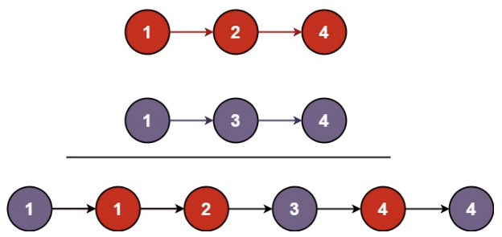

## I、题目描述
将两个升序链表合并为一个新的 升序 链表并返回。新链表是通过拼接给定的两个链表的所有节点组成的。 

<div align=center>

</div>


### 1. 示例

```bash
示例1
输入：l1 = [1,2,4], l2 = [1,3,4]
输出：[1,1,2,3,4,4]

示例2
输入：l1 = [], l2 = [0]
输出：[0]

示例3
输入：l1 = [], l2 = []
输出：[]
```
提示：

* 两个链表的节点数目范围是 [0, 50]
* -100 <= Node.val <= 100
* `l1`和 `l2`均按非递减顺序排列

## II、题解
### 1. 代码
```c++{.line-numbers}
/**
 * Definition for singly-linked list.
 * struct ListNode {
 *     int val;
 *     ListNode *next;
 *     ListNode() : val(0), next(nullptr) {}
 *     ListNode(int x) : val(x), next(nullptr) {}
 *     ListNode(int x, ListNode *next) : val(x), next(next) {}
 * };
 */
class Solution {
public:
    ListNode* mergeTwoLists(ListNode* list1, ListNode* list2) {
         
        //int i = 1;
        ListNode* Newlist = new ListNode();//先开空间给新的链表
        ListNode* cur = Newlist;
        //非递减，认为单调增但允许重复
        if(list1 == nullptr){
            Newlist = list2;
        }
        else if(list2  == nullptr){
            Newlist = list1;
        }
        else {
            while(list1 != nullptr && list2 != nullptr){
                /*cout<<"cycle: "<<i<<endl;
                i++;*/
                if(list1->val >= list2->val)//链表1中的元素比B中大
                {  
                    cur->val = list2->val; //赋值
                    //cout<<"bigger: "<<cur->val<<endl;
                    list2 = list2->next;//list指针移动
                    cur->next = new ListNode();
                    cur = cur ->next; 
                }
                else{ //小于
                    cur -> val = list1 -> val;
                    //cout<<"smaller: "<<cur->val<<endl;
                    list1 = list1->next;//指针的移动
                    cur->next = new ListNode();
                    cur = cur ->next;
                }
                
            }
            //将剩下的补充到末尾即可
            ListNode* tmp = list1 == nullptr? list2:list1;
            //cout<<"test: tmp="<<tmp->val<<endl;
            cur ->val = tmp->val; //元素赋值，直接连接上
            cur->next = tmp->next;
        }
        return Newlist;
    }
};
```

### 2. 分析
使用比较笨的方法求解：
1. 首先生成一个新的链表节点`NewNode`，作为头，并将头节点的地址赋值个`cur`指针，之后`cur`连接的也就相当于`NewNode`的其他节点；
2. 对于输入的`list1`和`list2`，先判断边界条件，如果空就直接输出；
3. 之后开始对两个链表比较，两个指针置于开头，若`list1`的值比`list2`大，则将`list2`此处的值置于第一位，并将指针向后移动一次，在进行比较，直到其中一个列表到达末尾；
4. 有一个到达末尾后，另一个可能还剩一个元素或者多个，但此时剩下的元素是有序的，且都比`NewNode`的小，因此直接将这个未到末尾元素直接赋值给`cur`指针的元素，并将`cur`指针的下一个指向未到末尾元素的下一个，相当于直接连接到原`list`的一部分上，即可完成合并。

## 附I：可能存在的问题
1. 对代码中的链表头和赋值部分，需要再仔细思考原因
```c++
ListNode* Newlist = new ListNode();//先开空间给新的链表
ListNode* cur = Newlist;
```

2. 对内存空间的管理，没有del开的空间，是否合理；以及没有对可能异常的处理，需要完善；
3. 题解中还有递归实现的方法以及更高效简洁的代码，重点看看双指针实现，尝试理解和复现；另外学习递归的方法；
4. 不同于尾部插入等方法，实现的代码中是直接对当前元素进行赋值，连接下一个指针(避免由于节点的构造方式造成头或尾出现0元素)，但这样每次都需要new一个新节点，是否有更高效的方式(比如只记录指针地址，在两个链表间进行穿插，而不需要每次新造一个链表节点，即cur为前一个，cur->next直接指向当前较小者的地址)


